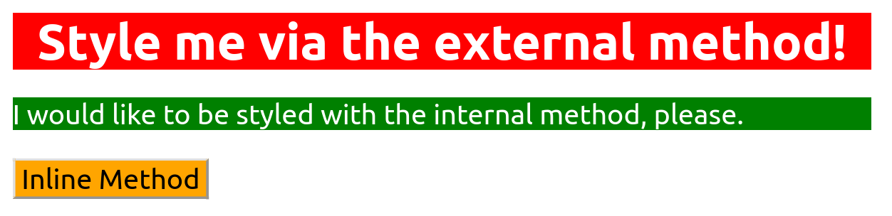

# Methods for Adding CSS

In this exercise, you're going to practice adding CSS to an HTML file using all three methods: 
• External CSS 
• Internal CSS 
• Inline CSS

You should only be using type selectors for this exercise when adding styles via the external and internal methods. 
Youy should also use keywords for colors (e.g. "blue") instead of using RGB of HEX values. 
 
There are three elements for you to add styles to, each of which uses a different
method of adding CSS to it, as noted in the outcome image below. All other exercises
in this section will have a CSS file provided and linked for you, but for this exercise
you will have to create the file and link it in the HTML file yourself.
This is all about practicing using these different methods and getting the syntax right.
 
The properties you need to add to each element are: 

• `div`: a red background, white text, a font size of 32px, center aligned, and bold 
• `p`: a green background, white text, and a font size of 18px 
• `button`: an orange background and a font size of 18px

## Desired Outcome

### Self Check

• Did you use all three methods of adding CSS to an HTML file? 
• Did you properly link the external CSS file in the HTML file? 
• Does the `div`element have CSS added via the external method? 
• Does the `p` element have CSS added via the internal method? 
• Does the `button` element have CSS added via the inline method?
